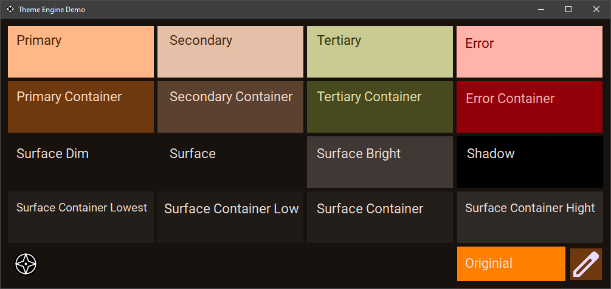

# Theme Engine

---
## How to use
1. Clone this repo.
2. Run Visual Studio 2022.
3. Install [MaterialColorUtilities](https://github.com/albi005/MaterialColorUtilities)
4. Build the project.
5. Run the demo from.
6. You have a small `.dll` library that you can link to your projects.

---